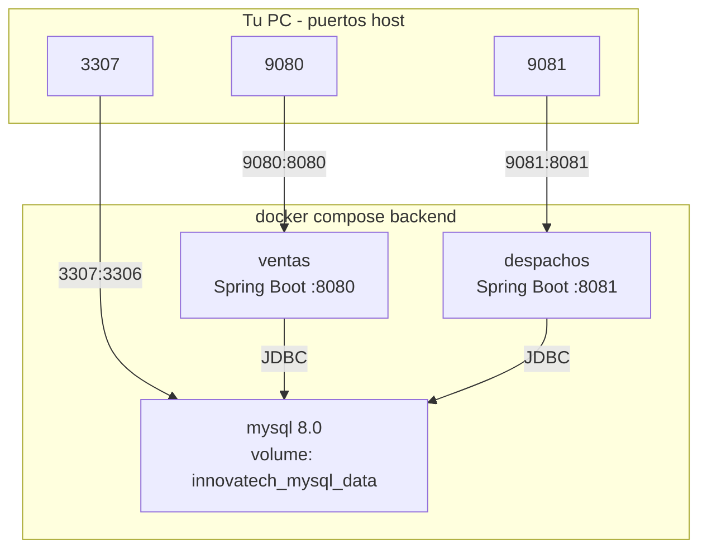
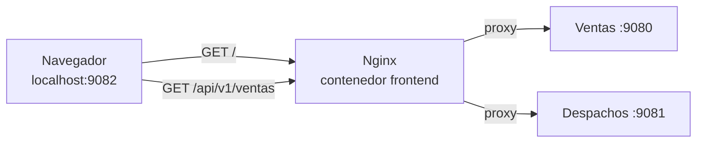

# Evidencias EP2 — Innovatech Chile
## Encargo DevOps (contenedorización + CI/CD)

**Integrantes:** _________________________________  
**Fecha:** _________________________________  
**Repos:**
- Frontend: https://github.com/Barrolas/innovatech-frontend
- Backend: https://github.com/Barrolas/innovatech-backend

> **Cómo usar:** Donde dice `[CAPTURA X]` pega la imagen en Word o escribe ``. Carpeta sugerida: `capturas/` junto a este archivo.

---

## Índice de capturas

### Fase A — Repos GitHub
| ID | Qué capturar | Estado |
|----|--------------|--------|
| A1a | Repo frontend con archivos (`Dockerfile`, `src/`, etc.) | ☐ |
| A1b | Repo backend con `docker-compose.yml` y carpetas `back-*` | ☐ |
| A2 | Ramas `main` y `deploy` en ambos repos | ☐ |
| A3 | Historial commits backend | ☐ |
| A3b | Historial commits frontend | ☐ |

### Fase B — Backend Docker
| ID | Qué capturar | Estado |
|----|--------------|--------|
| B1 | `docker compose up --build` backend sin errores | ☐ |
| B2 | `docker compose ps` — mysql, ventas, despachos | ☐ |
| B3 | `docker volume ls` — `innovatech_mysql_data` | ☐ |
| B4 | curl APIs 9080/9081 → HTTP 200 o Swagger | ☐ |
| B5 | Dockerfile multi-stage backend (`builder` + `appuser`) | ☐ |

### Fase C — Frontend Docker + proxy
| ID | Qué capturar | Estado |
|----|--------------|--------|
| C1 | `docker compose up --build` frontend sin errores | ☐ |
| C2 | App en navegador http://localhost:9082 | ☐ |
| C3 | DevTools → Network → `/api/v1/ventas` status 200 | ☐ |
| C4 | Dockerfile frontend (Node build + Nginx runtime) | ☐ |
| C5 | `nginx.conf.template` con rutas proxy | ☐ |
| C6 | `src/config/api.js` — URLs externalizadas | ☐ |

### Fases D–F — Pendiente (AWS + CI/CD)
| ID | Qué capturar | Estado |
|----|--------------|--------|
| D1 | Consola AWS — EC2 Front y Back running | ☐ |
| D2 | Security Groups (Front 80; Back 8080/8081 desde Front) | ☐ |
| D3 | ECR — 3 repositorios con imágenes | ☐ |
| E1 | GitHub Secrets configurados | ☐ |
| E2 | GitHub Actions workflow verde (rama deploy) | ☐ |
| F1 | App en navegador vía IP pública EC2 | ☐ |
| F2 | `docker ps` en EC2 Front y Back | ☐ |

---

# PARTE 1 — Repositorios GitHub (Fase A) ✅

## 1.1 Objetivo

Dos repos con ramas `main` y `deploy`, commits formato `[ TIPO ]`.

## 1.2 Pasos realizados

| Paso | Acción | Hecho |
|------|--------|-------|
| 1 | Repo `innovatech-frontend` público | ☑ |
| 2 | Repo `innovatech-backend` público | ☑ |
| 3 | Push código frontend | ☑ |
| 4 | Push código backend (solo `back-*`) | ☑ |
| 5 | Ramas `main` + `deploy` en ambos | ☑ |

## 1.3 Evidencia — Repos con código

**Frontend:** https://github.com/Barrolas/innovatech-frontend → pestaña **Code**

`[CAPTURA A1a]`

*Debe verse: `Dockerfile`, `nginx.conf.template`, `docker-compose.yml`, `src/config/api.js`*

**Backend:** https://github.com/Barrolas/innovatech-backend → pestaña **Code**

`[CAPTURA A1b]`

*Debe verse: `back-Ventas_SpringBoot/`, `back-Despachos_SpringBoot/`, `docker-compose.yml`*

---

## 1.4 Evidencia — Ramas main y deploy

Selector de rama en GitHub → deben existir **`main`** y **`deploy`**.

`[CAPTURA A2]`

---

## 1.5 Evidencia — Commits `[ TIPO ]`

### Backend (repo innovatech-backend)

| # | Mensaje |
|---|---------|
| 1 | `[ INIT ]: Estructura inicial microservicios Ventas y Despachos` |
| 2 | `[ FEAT ]: Agregar Dockerfile multi-stage para microservicio Ventas` |
| 3 | `[ FEAT ]: Agregar Dockerfile multi-stage para microservicio Despachos` |
| 4 | `[ CONFIG ]: Definir puerto 8080 y CORS en microservicio Ventas` |
| 5 | `[ FEAT ]: Agregar docker-compose con puertos host 9080/9081/3307 y named volume` |
| 6 | `[ FIX ]: Habilitar allowPublicKeyRetrieval para conexion MySQL 8 en Docker` |

`[CAPTURA A3]`

### Frontend (repo innovatech-frontend)

| # | Mensaje |
|---|---------|
| 1 | `[ INIT ]: Estructura inicial frontend React Vite` |
| 2 | `[ REFACTOR ]: Externalizar URLs de API a variables VITE_` |
| 3 | `[ FEAT ]: Agregar Dockerfile multi-stage con nginx reverse proxy` |
| 4 | `[ FIX ]: Corregir proxy nginx para evitar redirect 301 en APIs` |

`[CAPTURA A3b]`

---

# PARTE 2 — Backend Docker (Fase B) ✅

## 2.1 Objetivo

Dockerfile multi-stage, docker-compose con MySQL, named volume, prueba local.

## 2.2 Arquitectura backend



**Defensa oral:** Puertos **9080/9081/3307** solo en tu PC. En AWS los contenedores siguen en **8080/8081/3306**.

## 2.3 Archivos agregados

| Archivo | Ubicación |
|---------|-----------|
| Dockerfile Ventas | `back-Ventas_SpringBoot/Springboot-API-REST/Dockerfile` |
| Dockerfile Despachos | `back-Despachos_SpringBoot/Springboot-API-REST-DESPACHO/Dockerfile` |
| docker-compose.yml | Raíz repo backend |
| .env.example | Raíz repo backend |

## 2.4 Reproducir en local

```powershell
cd "e:\DOWNLOADS\Proyecto Semestral - DevOps - EV2"
copy .env.example .env
docker compose up --build -d
docker compose ps
curl.exe http://localhost:9080/api/v1/ventas
curl.exe http://localhost:9081/api/v1/despachos
docker volume ls
```

## 2.5 Capturas Fase B

| ID | Instrucción | Espacio |
|----|-------------|---------|
| **B1** | Terminal al terminar `docker compose up --build -d` (Built, Started, Healthy) | `[CAPTURA B1]` |
| **B2** | `docker compose ps` — 3 servicios running | `[CAPTURA B2]` |
| **B3** | `docker volume ls` con `innovatech_mysql_data` | `[CAPTURA B3]` |
| **B4** | Terminal `curl` con `[]` o Swagger en 9080/9081 | `[CAPTURA B4]` |
| **B5** | Dockerfile abierto: stages `builder` + `runtime`, `USER appuser` | `[CAPTURA B5]` |

### Justificación named volume (IE2/IE3) — copiar a Word

> Usamos **named volume** `innovatech_mysql_data` porque Docker gestiona la ruta de almacenamiento de forma independiente del filesystem del host (EC2). Garantiza portabilidad entre local y cloud, facilita la limpieza en instancias efímeras y asegura que los datos no se pierdan al reiniciar contenedores, cumpliendo la continuidad operativa del sistema.

---

# PARTE 3 — Frontend Docker + Nginx proxy (Fase C) ✅

## 3.1 Objetivo

Dockerizar React/Vite, externalizar URLs API, **reverse proxy Nginx** hacia backend (obligatorio para IE7 en AWS).

## 3.2 Por qué nginx proxy (texto para defensa)

El navegador del usuario **no puede** llamar a la IP privada del backend (10.x.x.x). Por eso:

1. Build con `VITE_API_*` **vacías** → el front usa URLs **relativas** (`/api/v1/ventas`)
2. Nginx en el contenedor front recibe esas peticiones
3. Nginx reenvía a `VENTAS_UPSTREAM` / `DESPACHOS_UPSTREAM` (IP privada back en AWS)

En **local**, el proxy apunta a `host.docker.internal:9080` y `:9081`.

## 3.3 Arquitectura integrada (local)



## 3.4 Archivos agregados

| Archivo | Función |
|---------|---------|
| `Dockerfile` | Stage 1: Node build · Stage 2: Nginx |
| `nginx.conf.template` | Proxy `/api/v1/ventas` y `/api/v1/despachos` |
| `docker-compose.yml` | Front en puerto host **9082** |
| `.env.example` | `VENTAS_UPSTREAM`, `DESPACHOS_UPSTREAM`, `FRONT_HOST_PORT` |
| `src/config/api.js` | Centraliza URLs; vacío = relativa (proxy) |
| Componentes CrudAdmin | Usan `ventasApi()` / `despachosApi()` |

## 3.5 Reproducir integración local

```powershell
# 1 — Backend (terminal 1)
cd "e:\DOWNLOADS\Proyecto Semestral - DevOps - EV2"
docker compose up -d

# 2 — Frontend (terminal 2)
cd "e:\DOWNLOADS\Proyecto Semestral - DevOps - EV2\front_despacho"
copy .env.example .env
docker compose up --build -d

# 3 — Verificar proxy
curl.exe http://localhost:9082/api/v1/ventas
curl.exe http://localhost:9082/api/v1/despachos
```

Abrir **http://localhost:9082** en el navegador.

## 3.6 Capturas Fase C

| ID | Instrucción | Espacio |
|----|-------------|---------|
| **C1** | Terminal `docker compose up --build -d` en `front_despacho/` sin errores | `[CAPTURA C1]` |
| **C2** | Navegador con la app cargada en http://localhost:9082 | `[CAPTURA C2]` |
| **C3** | F12 → pestaña **Network** → request a `/api/v1/ventas` con **Status 200** | `[CAPTURA C3]` |
| **C4** | `Dockerfile` frontend: stage `builder` (node) + stage `runtime` (nginx) | `[CAPTURA C4]` |
| **C5** | `nginx.conf.template` mostrando `location /api/v1/ventas` y `despachos` | `[CAPTURA C5]` |
| **C6** | `src/config/api.js` con `ventasApi` / `despachosApi` | `[CAPTURA C6]` |

### Tabla puertos local (referencia rápida)

| Servicio | URL |
|----------|-----|
| Frontend | http://localhost:9082 |
| Ventas API | http://localhost:9080/api/v1/ventas |
| Despachos API | http://localhost:9081/api/v1/despachos |
| MySQL | localhost:3307 |

---

# PARTE 4 — Problemas resueltos (defensa IE11)

Documentar en Word — demuestra dominio técnico.

## Problema 1 — MySQL "Public Key Retrieval is not allowed"

| Campo | Detalle |
|-------|---------|
| **Síntoma** | Contenedores ventas/despachos reiniciaban; APIs no respondían |
| **Causa** | MySQL 8 + autenticación caching_sha2_password en Docker |
| **Solución** | `allowPublicKeyRetrieval=true` en URL JDBC de `application.properties` |
| **Commit** | `[ FIX ]: Habilitar allowPublicKeyRetrieval para conexion MySQL 8 en Docker` |

`[CAPTURA opcional — log del error]`

## Problema 2 — Puertos ocupados en PC

| Campo | Detalle |
|-------|---------|
| **Síntoma** | Conflicto con otros contenedores en 8080/8081/3306 |
| **Solución** | Mapeo host `9080:8080`, `9081:8081`, `3307:3306`, front `9082:80` |
| **Commit** | `[ FEAT ]: Agregar docker-compose con puertos host 9080/9081/3307...` |

## Problema 3 — Nginx redirect 301 en APIs

| Campo | Detalle |
|-------|---------|
| **Síntoma** | `curl http://localhost:9082/api/v1/ventas` devolvía HTTP 301 |
| **Causa** | Trailing slash incorrecto en `proxy_pass` de nginx |
| **Solución** | Ajustar `location /api/v1/ventas` sin slash final conflictivo |
| **Commit** | `[ FIX ]: Corregir proxy nginx para evitar redirect 301 en APIs` |

`[CAPTURA opcional — Network tab antes/después del fix]`

---

# PARTE 5 — Pendiente (Fases D–F) — plantilla para cuando avances

Copia estas secciones a medida que completes AWS y CI/CD.

## 5.1 Fase D — AWS Learner Lab

**Pasos:** EC2 Front (pública) · EC2 Back (privada) · SG · ECR × 3 · Docker en EC2

| Dato anotado | Valor |
|--------------|-------|
| IP pública Front | _________________ |
| IP privada Back | _________________ |
| Región AWS | _________________ |

`[CAPTURA D1 — EC2 instances running]`  
`[CAPTURA D2 — Security Groups]`  
`[CAPTURA D3 — ECR repositories con imágenes]`

## 5.2 Fase E — GitHub Actions

**Pasos:** Secrets en ambos repos → `.github/workflows/deploy.yml` → push a `deploy`

| Secret | Repo |
|--------|------|
| AWS_ACCESS_KEY_ID, SECRET, SESSION_TOKEN | Ambos |
| ECR_REPOSITORY_VENTAS / DESPACHOS | Backend |
| ECR_REPOSITORY | Frontend |
| EC2_HOST, EC2_SSH_KEY, EC2_USER | Ambos |
| VENTAS_UPSTREAM, DESPACHOS_UPSTREAM | Frontend |

`[CAPTURA E1 — GitHub Secrets]`  
`[CAPTURA E2 — Actions workflow verde]`

## 5.3 Fase F — Deploy e integración AWS

| Verificación | Esperado |
|--------------|----------|
| Navegador `http://IP_PUBLICA_FRONT` | App carga |
| DevTools Network | `/api/v1/*` → 200 |
| Back no accesible desde internet | Solo Front público |
| `docker ps` en EC2 | Contenedores running |

`[CAPTURA F1 — App en IP pública]`  
`[CAPTURA F2 — docker ps EC2]`

---

# PARTE 6 — Resumen rúbrica (encargo)

| Ítem | Estado | IE |
|------|--------|-----|
| Dockerfile multi-stage backend | ✅ | IE1 |
| docker-compose backend | ✅ | IE2 |
| Named volume + justificación | ✅ | IE3 |
| Dockerfile + nginx front | ✅ | IE1 |
| URLs API externalizadas + proxy | ✅ | IE7 (local) |
| Pipeline CI/CD | ☐ | IE4 |
| Front en EC2 | ☐ | IE5 |
| Back en EC2 | ☐ | IE6 |
| Integración Front→Back AWS | ☐ | IE7 |
| README repos | ☐ | IE8 |

---

*Última actualización: Fases A, B y C completadas. Integrar capturas C1–C6 y completar Parte 5 cuando avances AWS.*
